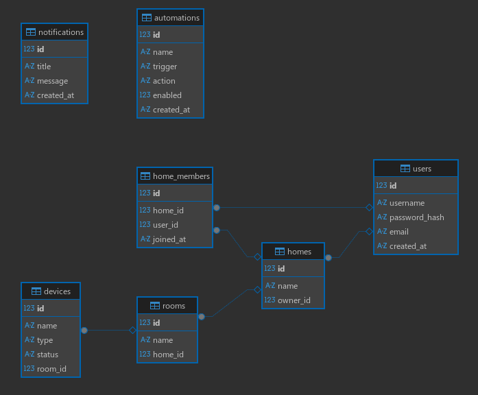

---

## Пояснения по функционалу и работе

- **Аутентификация**: реализована JWT (access token). При логине сервер возвращает `access_token`. Для защищённых маршрутов (создание устройства, отправка команд) используется `Depends(get_current_user)` — Android должен отправлять токен в заголовке `Authorization: Bearer <token>`.
- **Пароли**: хранятся в Bcrypt-хеше (passlib).
- **MQTT**:
  - MQTT-клиент запускается при старте приложения в lifespan.
  - При получении сообщения `on_message` мы парсим топик, извлекаем `device_id` и обновляем `Device.state` в SQLite.
  - При действиях из API (`/api/devices/{id}/action`) сервер вызывает `mqtt_service.publish_device_state`, что отправляет команду/состояние в топик — Raspberry Pi должен подписаться и выполнить действие.
- **Логи**: настроены через `utils.setup_logging`. Логи SQLAlchemy по умолчанию приглушены на WARNING, а пользовательские логи видны.
- **DB**: SQLite файл `iot_server.db` создаётся в корне при первом запуске (по `DATABASE_URL` в `config.py`).

---

## Запуск и проверка — пошагово

1. Установи зависимости (`pip install -r requirements.txt`).
2. Создай и активируй виртуальное окружение.
3. (опц.) создай `.env` и положи туда `JWT_SECRET`, `MQTT_BROKER` если хочешь.
4. Запусти:
   ```bash
   uvicorn app.main:app --reload

## Диаграмма БД

